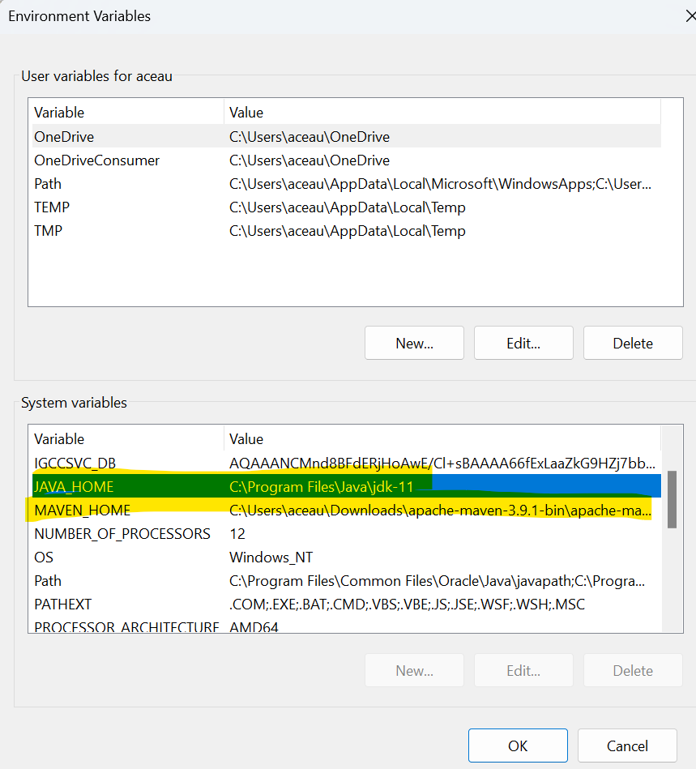

<h1 align="center"> Appium Test with Real Android device on Real App </h1>

  Description: This is a demo testcase on Appium Test framework with Java programming language

## Table of Contents

- [Introduction](#introduction)
- [Features](#features)
- [Requirements](#requirements)
- [Quick Start](#quick-start)

## Introduction
This is a demo testcase on java tech with TestNg and selenium test.

## Features
Appium Tests

## Test Requirements

### Local
* [Java 11 SDK](https://www.oracle.com/au/java/technologies/javase/jdk11-archive-downloads.html)
* [Maven](https://maven.apache.org/download.cgi)

## Execution modes ## 🤖 Starting up

<b>Step 1: You need to have Java, Maven setup in your machine that you have want to script and run Appium Tests (pre-requisite).</b>

make sure you have configured the JAVA_HOME and MAVEN_HOME in your environment system variables

The below command helps to check java and maven in your machine

> java -version
> mvn -version

Setup Java and Maven system environment variables post installation

<b>Step 2: You need node installed in your machine</b>

The below command helps to check node in your machine

node -v
If node is not in the machine you can follow the steps:

https://nodejs.org/en/download

<b>Step 3: Install Appium in the machine</b>

The below command helps to install Appium server in your machine using node

node appium
the below short command helps to start the Appium server

appium

<b>Step 4: About the Android phone and how to connect to your machine order to use the real android device to you machine — Connect the phone via USB cable, post connecting the phone you need to do below steps: </b>

Go to the Android phone settings > About phone > Click on version 7 times and the phone should get converted into Developer options

now go to Developer options- if you are not able to see that option follow the below path.

After the above is done go to Android phone settings > Additional settings > Developer options > USB debugging (Enable)

Post these steps please run the below command to verify your android mobile is really connected or not

adb devices

now incase you are getting an error, most probably that's because either your phone is not in USB debugging mode or you don't have platform tools in environment variables

Adding platform tools to the PATH environment variable
Instagram bot for automated Instagram interaction using Android device via ADB - Adding platform tools to the PATH…
github.com

Try reconnecting your phone as well

<b>Step 5: About capabilities of mobile app that you are testing</b>

Understanding capabilities are the most important part of the appium as it needs to know which device, which OS, which mobile app etc needs to be launched to test. The below set up capabilities will give you an idea about the capabilities

cap.setCapability("deviceName","OPPO Find X3 Pro");
cap.setCapability("udid","4d897317");
cap.setCapability("platformName","Android");
cap.setCapability("platformVersion","11");
cap.setCapability("automationName","uiAutomator2");
cap.setCapability("appPackage","com.ubercab");
cap.setCapability("appActivity","com.ubercab.presidio.app.core.root.RootActivity");
in the above set of capabilities it helps Appium code to understand that which device, which OS, which OS platformversion, which driver, which app, which activity needs to be launched to start Appium tests.

<b>Step 6: Install Appium driver in your machine</b>

Appium needs one of the Appium drivers to be installed and present prior to running the test. So in this case as we are using Android mobile app we need to use ‘UiAutomator2’ as our Appium driver. Now if you are still doubtful on which Appium driver to use then kindly have a look at the official Appium driver documentation

https://appium.io/docs/en/2.1/quickstart/uiauto2-driver/

<b>Step 7: Installation of android sdk platform tools</b>

Android sdk platform tools needs to be downloaded and installed.

https://developer.android.com/tools/releases/platform-tools

post installation — the environment path needs to be setup for the ANDROID_HOME

<b>Step 8: Setting up ANDROID_HOME in environment variables</b>

post installation in above step the environment system variables the ANDROID_HOME needs to be setup

<b>Step 9: Install Appium inspector to inspect the elements on the mobile app</b>

Appium inspector is a tool used to provide you the best possible selectors which can help you in Appium tests.

Appium inspector starting session

The section which provides the best selectors
<b>Step 10: Launching mobile application using Appium</b>

After writing the simple steps of launching the mobile app and then using the Appium driver steps to navigate on the app and validating, you will be able to successfully run the Appium tests

